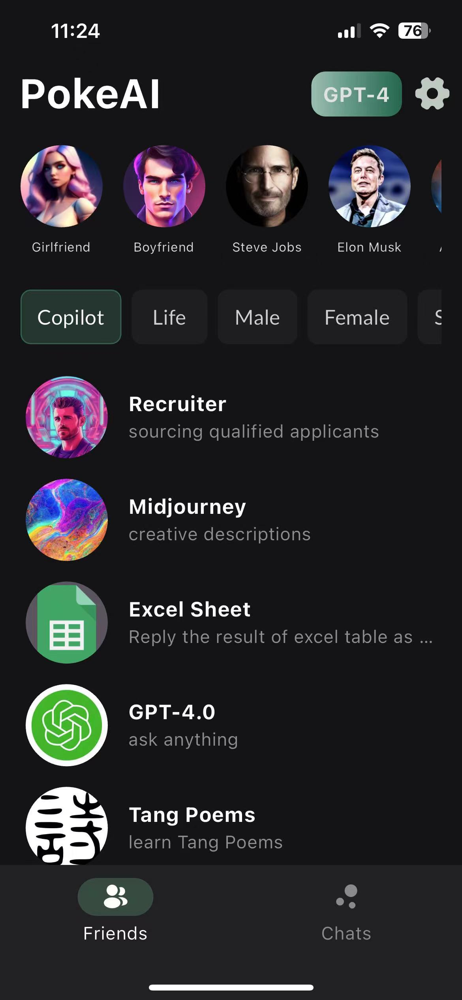
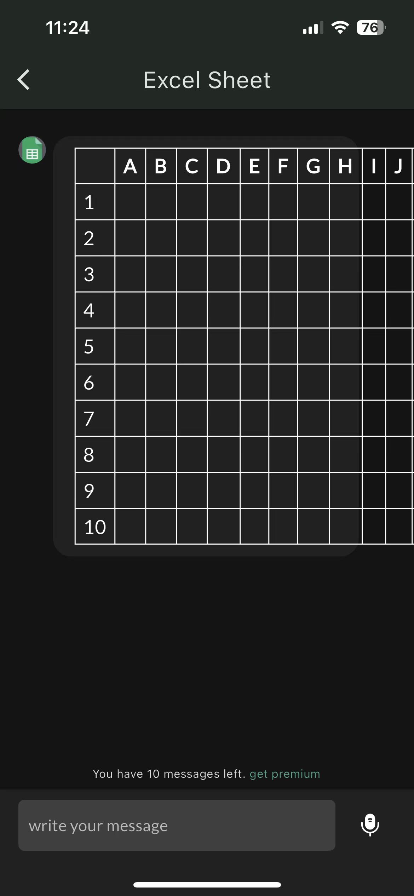
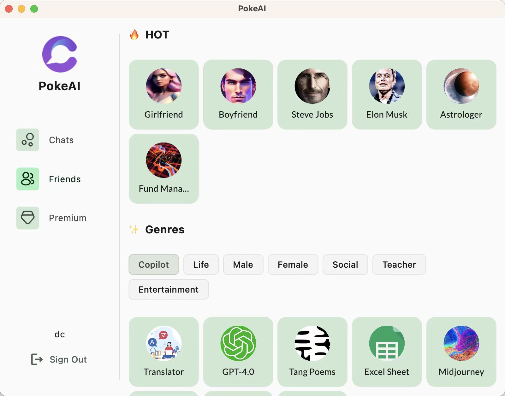
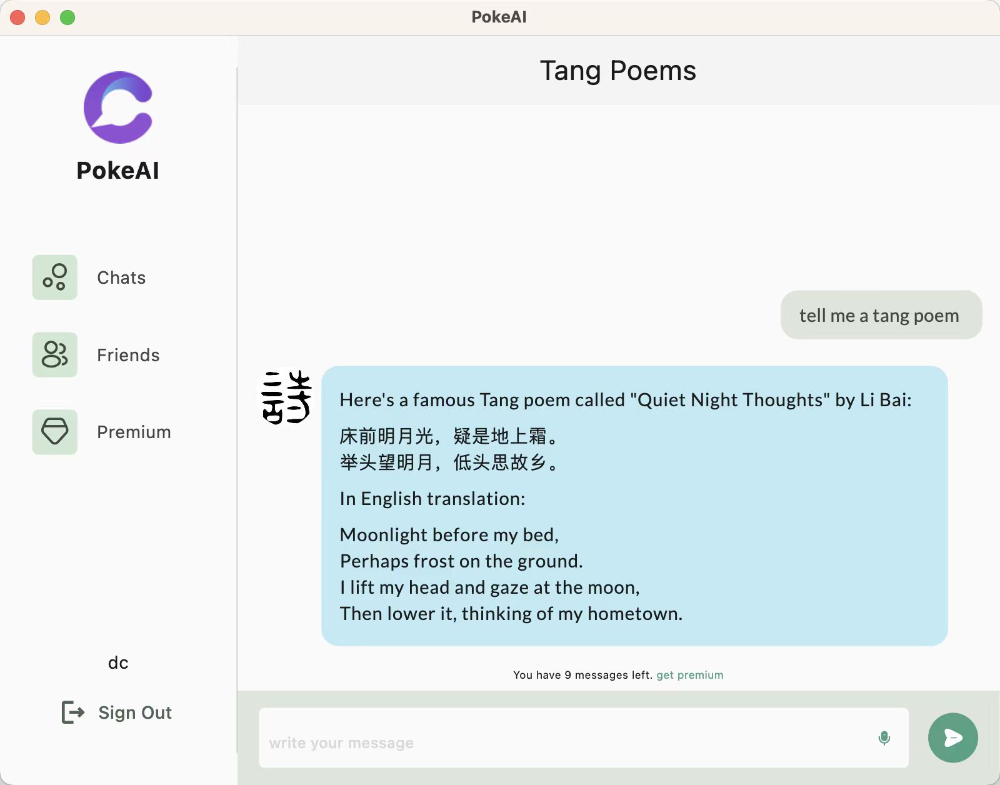
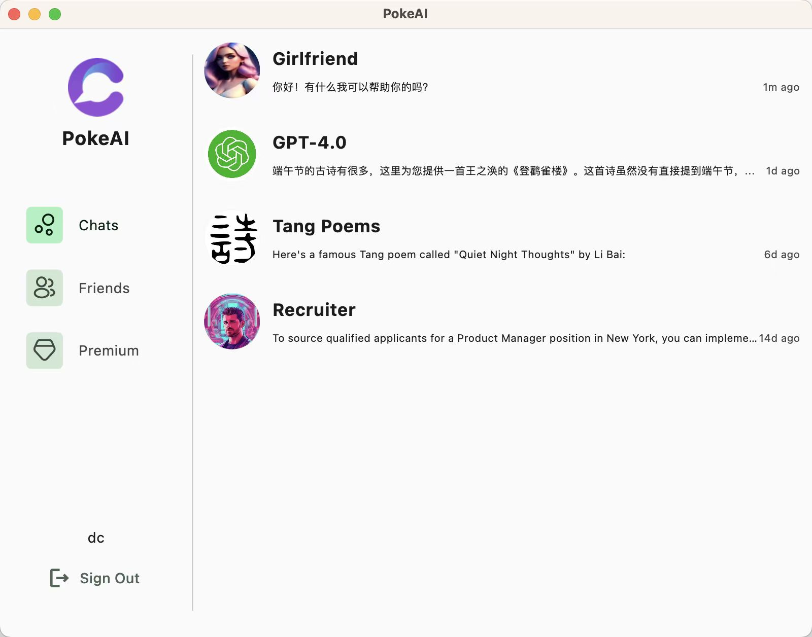

# PokeAI- CHAT ASK COMPANION

## Welcome to download PokeAI

## Closer to the people you love

  

## What's PokeAI?

PokeAI AI virtual humans, make life fun and work easier. Each character is an AI-powered 4.0.  
"PokeAI can quickly find a smart, interesting, knowledgeable, simple, and sincere friend, making your life full of warm care and beautiful hope,  Less Lonely and More Connected ." and we're excited for you to experience it.
[chat]
· Chat with AI friends,about any topic
· Ask anything
· Get instant answears
· Practice any language
· Get the most human-like companion
· Get creative 
· Write anything effortlessly
You’ll feel like you’re chatting with a friend. every character is friendly, conversational tone and personalized recommendations make it easy to chat about anything, from the mundane to the profound.

## Features

### Supported

* platforms:
  * Android,ios,macos
---
* User features:
  * ChatGPT-4.0 support.
  * chat with character One-on-one messaging.
  * Voice input.
  * All chats are synchronized across all devices.
  * purchase by apple pay or google pay.
  * limited conversation.
  
* Administration:
  * create new character.

### Planned

* create characters by users
* share messages
* voice call
* files upload
* picture messages
* Attaching music/audio other than voice messages.
* Better emoji support.
* Different levels of message persistence (from strict persistence to "store until delivered" to purely ephemeral messaging).
* Message encryption at rest.
* End to end encryption with [OTR](https://en.wikipedia.org/wiki/Off-the-Record_Messaging) for one-on-one messaging and undecided method for group messaging.
* Full text search in messages.

### Characters

| name | Categories | profile |
| --- | :---: | :---: |
| Cat | Entertainment | Meowww   | 
| 	Darwin | Male | English naturalist, geologist, and biologist |
| 	Einstein | Male | developing the theory of relativity， quantum mechanics | 
| Translator | Copilot | Translator | 
| Girlfriend | Female |  | 
| Boyfriend | Male |   | 
| Steve Jobs |   | &check; | 
| Portugese | &check; |   | &check; |   
| Elon Musk |   | &check; | &check; |  
| Astrologer | &check; | &check; | &check; | 
| Travel advisor | &check; | &check; | &check; | 
| The game of life | &check; |   |   |  
| Joker |  |  |

More translations are [welcome](docs/translations.md). In addition to languages listed above, particularly interested in Arabic, Bengali, Indonesian, Urdu, Japanese, Turkish, Persian.

## Third-Party

### Projects

* [ChatGPT-4.0](https://platform.openai.com/docs/introduction)
* [awesome-chatgpt-prompts](https://github.com/f/awesome-chatgpt-prompts)
* [character.ai](https://beta.character.ai/)
* [poe](https://poe.com/)
* [claude.ai](https://claude.ai/)

## Screenshots

### [iOS][Android]

  

### [Mac]

    

#### SEO Strings

Words 'chat' and 'instant messaging' in Chinese, Russian, Persian and a few other languages.

* 聊天室 即時通訊
* чат мессенджер
* インスタントメッセージ
* 인스턴트 메신저
* پیام رسان فوری
* تراسل فوري
* فوری پیغام رسانی
* Nhắn tin tức thời
* anlık mesajlaşma sohbet
* mensageiro instantâneo
* pesan instan
* mensajería instantánea
* চ্যাট ইন্সট্যান্ট মেসেজিং
* चैट त्वरित संदेश
* তাৎক্ষণিক বার্তা আদান প্রদান
